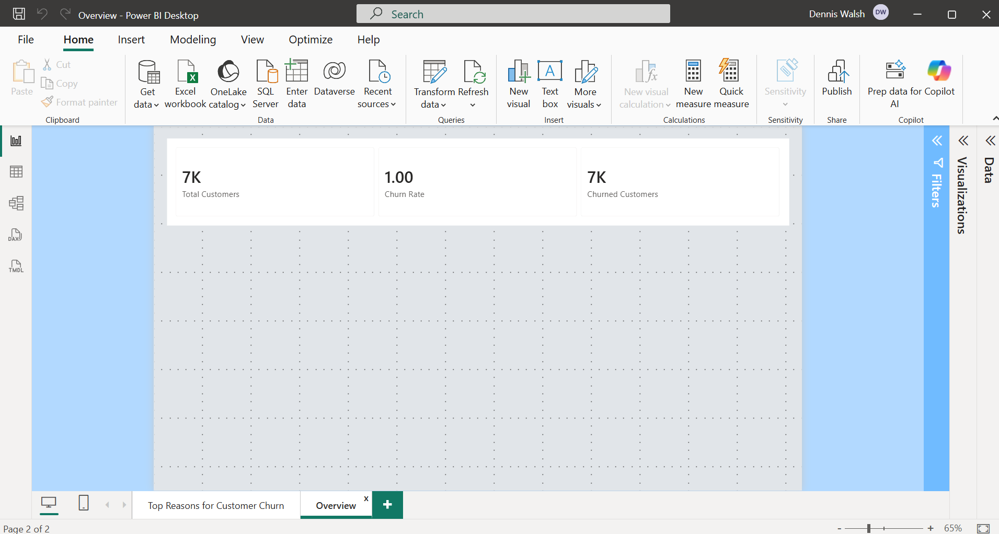
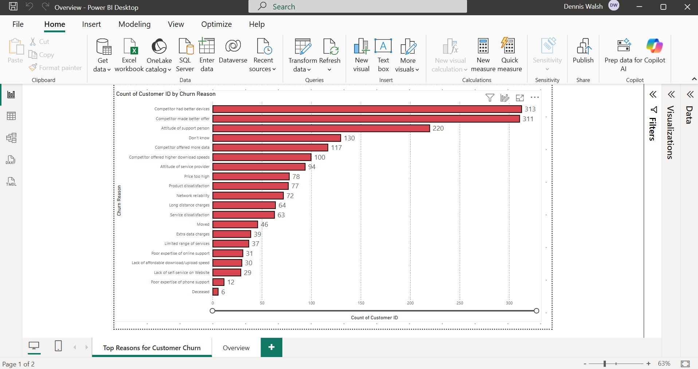
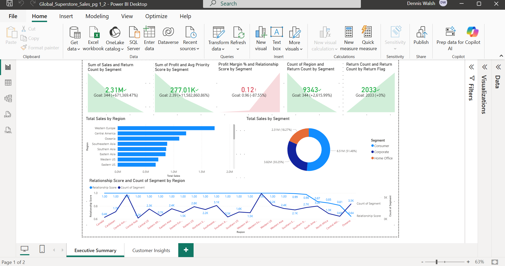
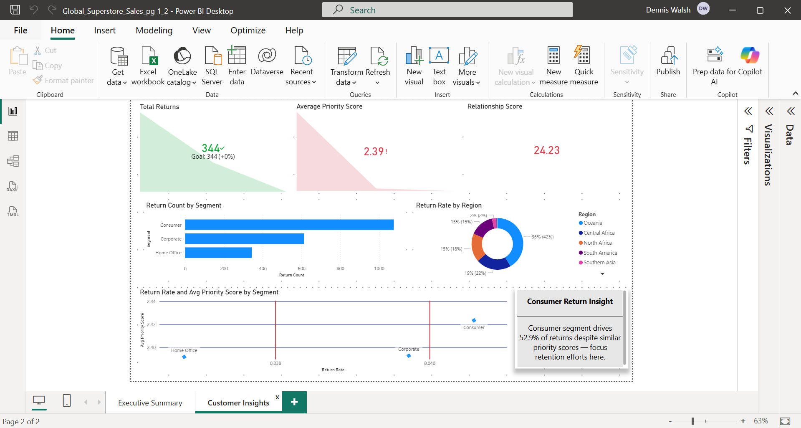

👋 Dennis Walsh - Service QA & Data Analytics Portfolio

Welcome! I'm a Service & QA professional with hands-on experience testing web, mobile, and networked applications in cloud and on-premise environments as well as data analytics.

**Power BI Dashboards**

- Dynamic interactive dashboards built with Power BI, showcasing DAX measures and data modeling.

### Telecom Customer Churn Analysis

**Objective**: Identify churn patterns and drivers in a telecom dataset to support retention strategies.

**Key Insights**:
- Churn rate by tenure, services (Online Security, Tech Support), contract type.
- Revenue impact from churned customers.
- Recommendations: Promote longer contracts and bundled services to reduce churn.

**Dashboard Screenshots**

#### Churn Rate Overview

#### Churn Reasons & Drivers

#### Sales Performance

#### Sales Returns Analysis

*Interactive features include slicers for region/contract type, drill-downs, and custom DAX measures.*

Open to QA Engineer and Power BI Data Analyst roles

📫 dlw10053@gmail.com | LinkedInlinkedin.com/in/dennislwalsh/)
