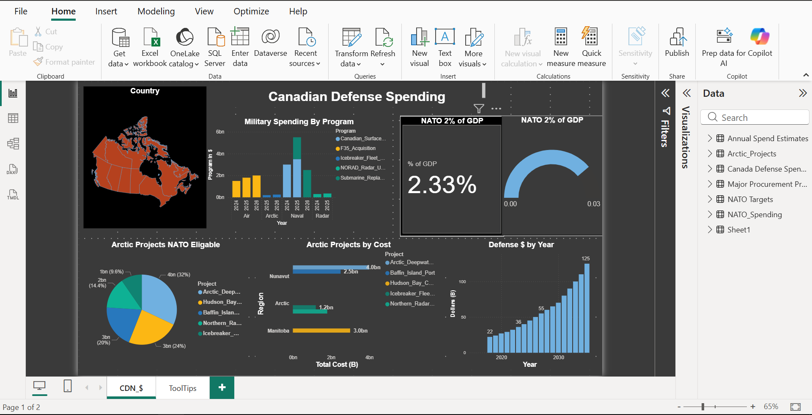
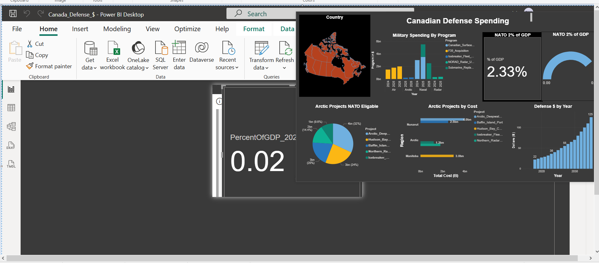

👋 Dennis Walsh - Service QA & Data Analytics Portfolio

Welcome! I'm a Service & QA professional with hands-on experience testing web, mobile, and networked applications in cloud and on-premise environments as well as data analytics.

**Power BI Dashboards**

- Dynamic interactive dashboards built with Power BI, showcasing DAX measures and data modeling.

### Telecom Customer Churn Analysis

**Objective**: Identify churn patterns and drivers in a telecom dataset to support retention strategies.

### Global Superstore Sales and Return Analysis

**Objective**: Identify Sales by region, segment and returns by region and segment 

### Canada Defense Spending Analysis & Tool Tip

**Objective**: Identify Canada Defense Spending as a % of GDP, by program and projects 

**Dashboard Screenshots**

#### Churn Rate Overview

#### Churn Reasons & Drivers

#### Sales Performance

#### Sales Returns Analysis

 
#### Canada Defense Spending

#### Tool_Tip 

*Interactive features include slicers for region/contract type, drill-downs, and custom DAX measures.*

Open to QA Engineer and Power BI Data Analyst roles

📫 dlw10053@gmail.com | LinkedInlinkedin.com/in/dennislwalsh/)
